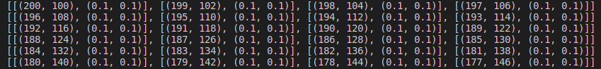

# Reinforcement learning :notebook_with_decorative_cover:

> Jupyter notebooks of the algorithms developed in the Self-Optimizing Systems ([HAW hamburg](https://www.haw-hamburg.de/studium/studiengaenge-a-z/studiengaenge-detail/course/courses/show/informatik/)) class.

The vehicle's task is to start from an initial position and speed and move towards a goal in a straight line, modifying its speed in order to not invade a person's personal space. 

The vehicle state ( $s^v$ ) is given by its position and velocity constrained to the y-axis.
The vehicle detects a human and stores 4 sequential positions to generate an observation.
These positions are points ( $\mathbf{P}$ ) in the plane recorded at arbitrary time intervals $\Delta t$.
While the human velocity ( $\dot{p}^h$ ) can be obtained from the positions and the elapsed time.

Where $\mathcal{O}\in \Re^8$ and $\mathcal{A}\in \Re^2$. \\

The action $\alpha$ is a control variable that updates the current velocity.

The reward ( $R$ ) is obtained by:

where $l = 1 + \beta \dot{p}^h$. 

The vehicle receives a reward $r_g$ that increases as it gets closer to the goal. 

While it receives a penalty when it approaches the human 

Rewards obtained in an instant of time, when $s^h = \{3,5,1.4\}$ and the goal is at $\mathbf{P}^g(8,-7.5)$.

The end of an episode is defined by the following terminal states:
  * The vehicle reaches the goal, i.e. $|\mathbf{P}^g - \mathbf{P}^v| \approx 0$
  * The vehicle invades personal space, i.e. $|\mathbf{P}^h - \mathbf{P}^v| < l^2$
  * The vehicle is moving backwards, i.e. $\dot{p}^h < 0$

## V2 pygame simulation

Restricted to one pedestrian with rectilinear motion.

Experience buffer composed by the position and speed of 4 observations.
$Experience = ((p_{1x}, p_{1y}, v_{1x},v_{1y}), (p_{2x}, p_{2y}, v_{2x},v_{2y}), (p_{3x}, p_{3y}, v_{3x},v_{3y}), (p_{4x}, p_{4y}, v_{4x},v_{4y})) $

Execution example:

  

### References

David Silver. (2015). Lectures on Reinforcement Learning.

Sutton, R. S., & Barto, A. G. (2018). Reinforcement learning: An introduction. MIT press.
